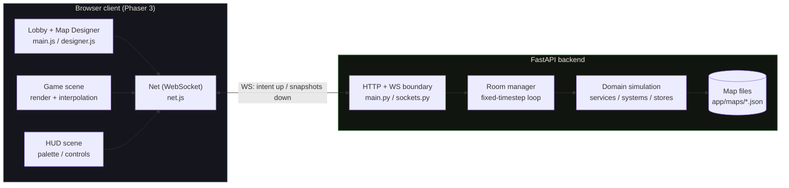
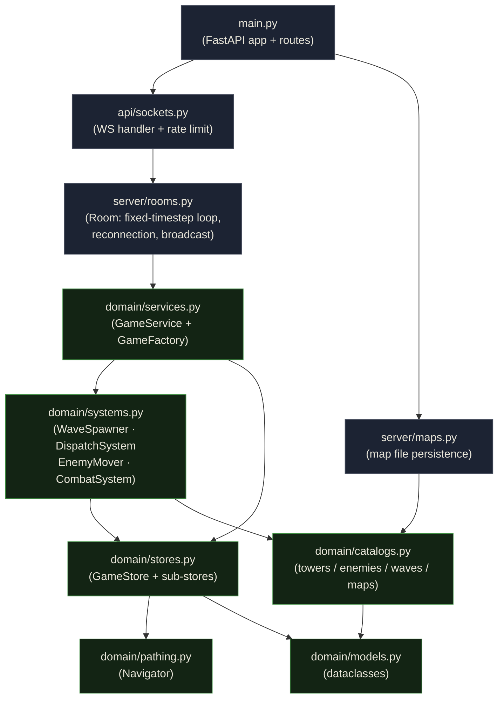
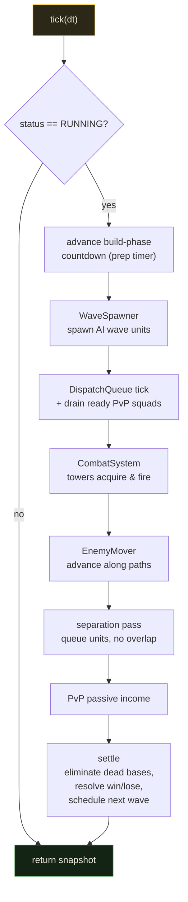
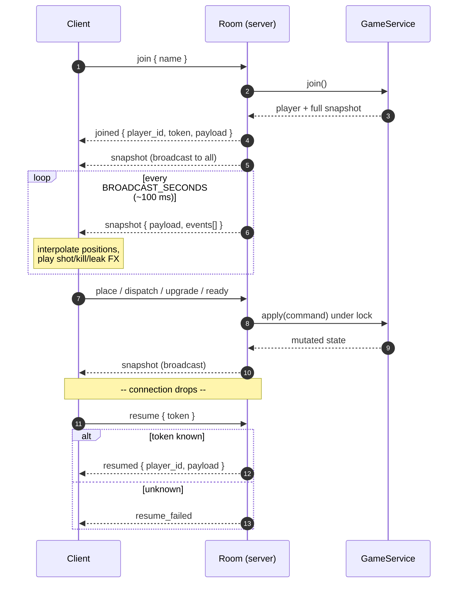
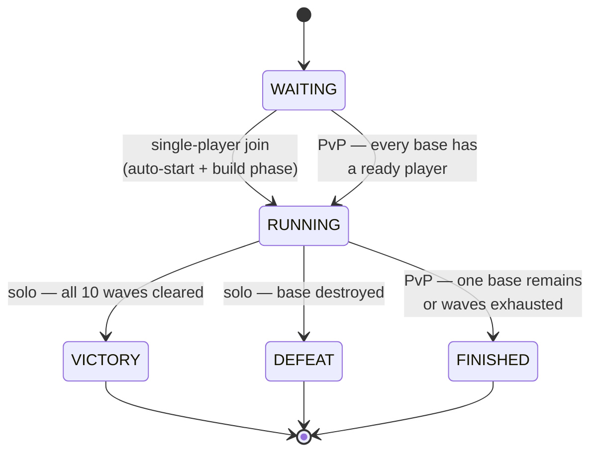
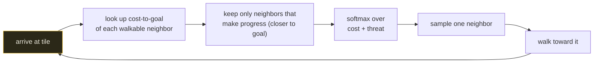

# Warzone Tower Defense — Multiplayer

A real-time, WWII-themed multiplayer tower defense game. A **server-authoritative**
Python backend runs the entire simulation on a fixed timestep; thin browser
clients send player intent and render interpolated snapshots streamed over
WebSockets.

- **Single-player** — survive 10 escalating AI waves on your own map.
- **PvP** — 2 or 4 players each defend an HQ and spend income to *dispatch*
  enemy squads at their opponents. Last base standing wins.

> The server validates and simulates every action. Clients never decide
> outcomes — they only draw what the server reports, which keeps the game
> cheat-resistant and every client perfectly in sync.

---

## Table of contents

- [Architecture](#architecture)
- [Repository layout](#repository-layout)
- [Backend design](#backend-design)
- [The simulation tick](#the-simulation-tick)
- [Realtime protocol](#realtime-protocol)
- [Match lifecycle](#match-lifecycle)
- [Pathfinding](#pathfinding)
- [Maps & the in-browser designer](#maps--the-in-browser-designer)
- [Getting started](#getting-started)
- [Tests](#tests)
- [Tech stack](#tech-stack)

---

## Architecture

The browser never runs game logic. It opens one WebSocket per room, sends
intent (`place`, `dispatch`, `ready`, …), and renders the snapshots the server
broadcasts ~10×/second. In development, Vite proxies `/api` (HTTP **and** WS) to
the backend, so the client is effectively same-origin.



**Intent up, state down.** A client message is applied under a per-room lock,
the resulting state is broadcast to everyone, and a separate fixed-timestep loop
keeps advancing the simulation between inputs.

---

## Repository layout

```text
.
├── backend/
│   ├── app/
│   │   ├── api/          HTTP schemas + WebSocket handler (FastAPI boundary)
│   │   ├── domain/       Pure game logic — no framework imports
│   │   │   ├── models.py      Dataclasses: Tile, Enemy, Tower, MapDefinition…
│   │   │   ├── catalogs.py    Static balance data + map loading
│   │   │   ├── stores.py      Mutable per-match state containers
│   │   │   ├── systems.py     Spawning, movement, separation, combat
│   │   │   ├── pathing.py     Nondeterministic Dijkstra navigation
│   │   │   ├── validators.py  Command pre-conditions
│   │   │   ├── services.py    GameService — orchestrates a single match
│   │   │   └── snapshots.py   Domain state → client-safe JSON
│   │   ├── server/       Room lifecycle, broadcasting, map persistence
│   │   └── maps/         Built-in + designer-saved map JSON
│   └── tests/            Behavior-focused unit tests
│
└── client/              Phaser 3 front-end (Vite)
    ├── src/
    │   ├── main.js        Lobby, map-select, Phaser bootstrap
    │   ├── config.js      Presentation data (palette, tooltip stats)
    │   ├── net.js         WebSocket client
    │   ├── map.js         Paints the static map layer into a scene
    │   ├── designer.js    In-browser map editor
    │   └── scenes/        Boot (preload) · Game (render) · Hud (controls)
    └── public/
        ├── assets/        Sprites + manifest.json
        └── maps/          Client copies of map JSON (previews)
```

The **domain** package is deliberately framework-free: it imports no FastAPI and
no asyncio, so the whole game is testable as plain Python and the network layer
is a thin shell around it.

---

## Backend design

Layers depend strictly inward — the API knows about the domain, but the domain
knows nothing about the web.



A `Room` owns one `GameService` and an `asyncio` loop. The loop sleeps in fixed
`SIM_SECONDS` (50 ms) slices, accumulates real elapsed time, and advances the
simulation in whole steps so **play speed never depends on event-loop jitter**.
Snapshots are throttled to `BROADCAST_SECONDS` (100 ms).

---

## The simulation tick

Every step runs the same ordered pipeline. Nothing happens unless the match is
`RUNNING`.



**Movement & separation.** Units always advance freely along a per-tile path;
a second pass then nudges the *rear* unit of any overlapping pair backward so
columns form a tidy single-file queue. Because the column leader is never
pushed, the system **cannot deadlock** — crowds resolve instead of freezing.

---

## Realtime protocol

The socket is authoritative and reconnection-friendly. A dropped client keeps
its slot (and its towers, once a match is running) during a grace window and can
re-attach with a saved token.



**Client → server:** `join` · `resume` · `ready` · `place` · `dispatch` ·
`upgrade` · `ping`
**Server → client:** `joined` · `resumed` · `resume_failed` · `snapshot` ·
`error` · `pong`

Per-tick `snapshot` messages carry only **dynamic** state (the static `map` is
sent once on `join`/`resume`) plus an `events[]` array the client replays for
effects: `shot` · `kill` · `leak` · `placed` · `upgraded` · `dispatched` ·
`unit_upgraded` · `eliminated`.

Each connection is protected by a leaky-bucket rate limiter sized for brisk
human play.

---

## Match lifecycle



A single-player map starts the instant a player joins (no lobby). A PvP match
**will not start with a lone player** — it waits until every base has a ready
defender, then starts automatically.

---

## Pathfinding

Enemies do not follow scripted lanes. When the tower layout changes, the
`Navigator` runs **one backward Dijkstra per active team** from that team's base,
producing a cost-to-goal field for every walkable tile. The cost of a tile rises
with the tower DPS that covers it, so heavily-defended ground is naturally
avoided.

At every tile arrival a unit re-decides its next step:



Because the choice is *probabilistic* (softmax temperature `0.5`), equidistant
routes split traffic at real junctions while sharply-worse detours get
near-zero weight. The result: units fan out across the map and take genuinely
different routes each run, with no backtracking and no fixed lane to exploit.

Placement is validated against a connectivity check (`is_reachable`), so a tower
can never fully wall off a spawn from its target base.

---

## Maps & the in-browser designer

Maps are plain JSON (`backend/app/maps/*.json`): grid size, base/spawn
positions, water, decorations, and optional road art. The loader derives the
buildable tile set automatically.

| Map | Mode | Players |
|-----|------|--------:|
| `bocage_run` | single | 1 |
| `river_crossing` | single | 1 |
| `hedgerow_maze` | single | 1 |
| `twin_fronts` | pvp | 2 |
| `crossroads` | pvp | 2 |
| `four_corners` | pvp | 4 |

The lobby includes a **map designer** (`client/src/designer.js`): paint roads,
water, obstacles, HQs and spawns on a grid, then **Save** — the backend
validates the layout, derives lanes, and writes a new `custom_*.json` that
appears in the map list immediately.

---

## Getting started

### Prerequisites

- Python ≥ 3.10
- Node ≥ 18

### 1. Backend (run from the repo root)

```bash
python3 -m venv .venv
source .venv/bin/activate
pip install -r backend/requirements.txt

uvicorn backend.app.main:app --reload --port 8000
```

The API exposes:

| Method | Path | Purpose |
|--------|------|---------|
| `GET`  | `/health` | Liveness probe |
| `GET`  | `/api/v1/maps` | List playable maps |
| `GET`  | `/api/v1/maps/{id}` | Full map JSON |
| `POST` | `/api/v1/maps` | Save a designer map |
| `POST` | `/api/v1/rooms` | Create a room for a chosen map |
| `WS`   | `/api/v1/rooms/{id}/ws` | Join and play |

CORS origins default to the local Vite ports; override in production:

```bash
export WARZONE_ALLOWED_ORIGINS="https://play.example.com"
```

### 2. Client

```bash
cd client
npm install
npm run dev
```

Open the URL Vite prints (default `http://127.0.0.1:5173`). Vite proxies `/api`
(HTTP + WebSocket) to the backend on port 8000, so no extra configuration is
needed — just have both running.

To create a shareable PvP match: pick a PvP map, **Create Room**, share the room
code shown in the top-right, and have the second player paste it into the
*Room ID* field.

---

## Tests

The domain is plain Python, so the behavior suite runs fast with no server:

```bash
python3 -m pytest                                       # full suite
python3 -m pytest backend/tests/test_game_service.py    # game rules only
```

Coverage spans match start gating, dispatch economics and squad upgrades,
combat rewards, PvP income, reconnection/room reaping, enemy spacing &
leak-on-contact, and map-file persistence.

---

## Tech stack

| Layer | Tech |
|-------|------|
| Backend | Python · FastAPI · Pydantic · asyncio · `uvicorn` |
| Simulation | Pure-Python domain (dataclasses, `heapq` Dijkstra) |
| Client | Phaser 3 · Vite · vanilla ES modules |
| Transport | WebSocket (JSON) + REST for room/map management |

All code, art, maps, and names are original.
