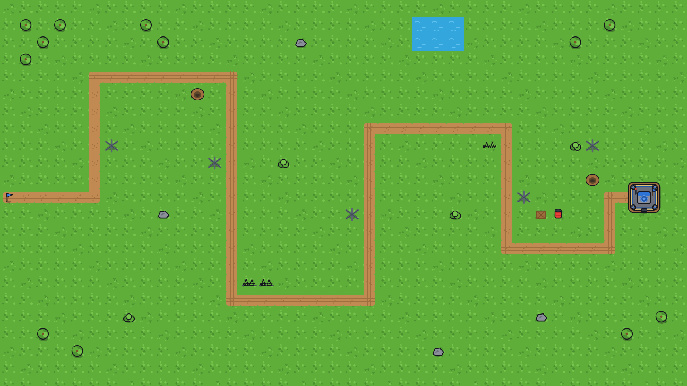
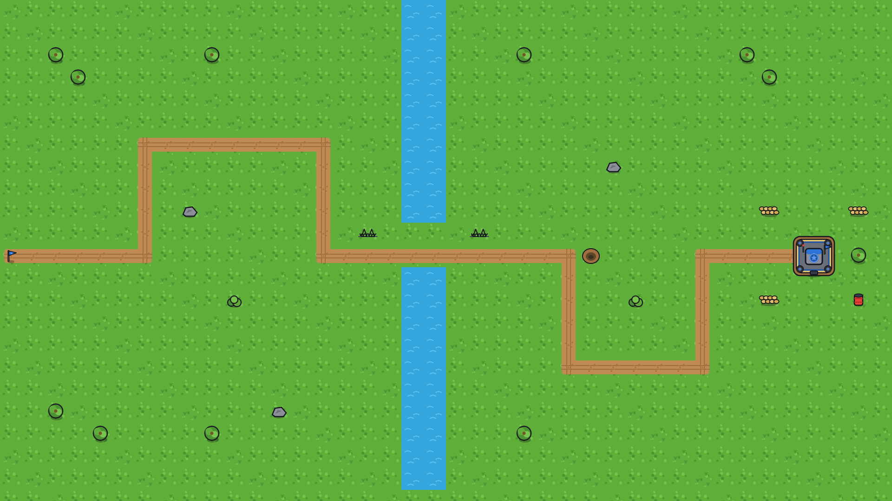
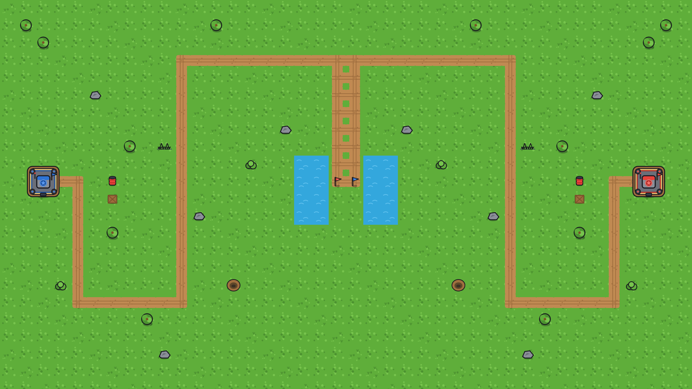
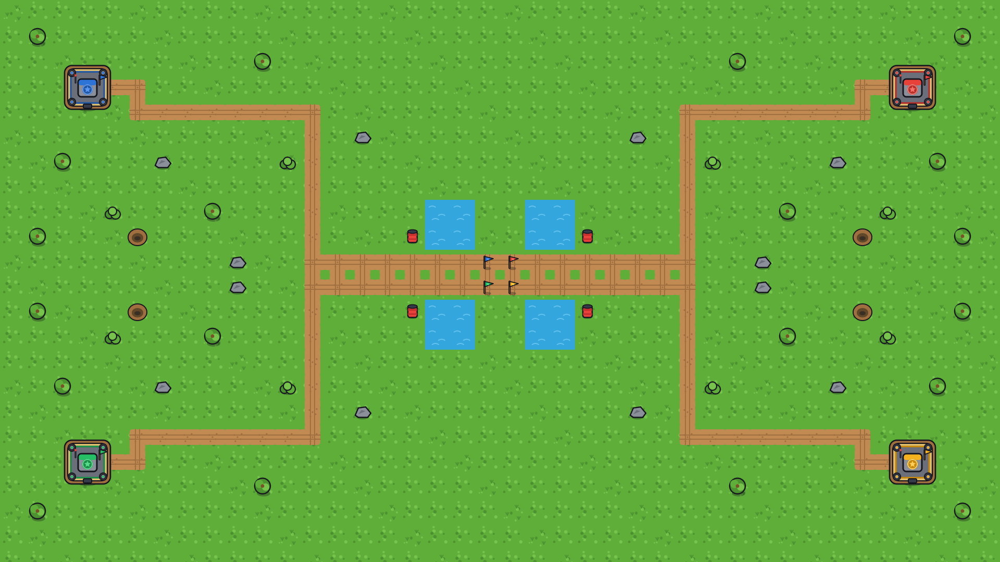

# Maps

Four ready-to-load maps at **1920×1080** on the 48px grid (40 cols × 22 rows;
grass tiles to the full 1080 height). Data is in `public/maps/<id>.json`,
preview images in `public/maps/previews/<id>.png`.

| id | Name | Mode | Players | Symmetry | Notes |
|---|---|---|---|---|---|
| `bocage_run` | Bocage Run | single | 1 | none | Long S-bend lane, hedgerow/rock obstacles, corner pond. |
| `river_crossing` | River Crossing | single | 1 | none | Vertical river splits the field; lane crosses a bridge gap. |
| `twin_fronts` | Twin Fronts | **pvp** | 2 | mirror-X | Bases L/R, two mirrored lanes, split central lake. |
| `four_corners` | Four Corners | **pvp** | 4 | mirror-XY | Four corner bases, four lanes into a quartered central lake. |

Previews (in `map_previews/`):






**Fairness:** PvP maps are **transform-generated** — only one region is authored,
and the engine mirrors it (X for 2P, X+Y for 4P). Every player therefore gets a
geometrically identical lane, base position, and obstacle layout by construction.

## Obstacles
Maps include impassable/no-build features: **water** (river, lakes), **trees,
rocks, bushes, hedgehogs (tank traps), barbed wire, sandbags, craters, crates,
barrels**. All of these (plus lane cells and base footprints) are precomputed
into the `blocked` list, so towers can't be placed on them.

---

## JSON schema (`public/maps/<id>.json`)
```jsonc
{
  "id": "twin_fronts", "name": "Twin Fronts", "mode": "pvp",
  "players": 2, "symmetry": "x",
  "tile": 48, "cols": 40, "rows": 22, "width": 1920, "height": 1080,
  "groundFill": "grass",
  "bases":  [ { "team": "p1", "x": 2,  "y": 10 }, { "team": "p2", "x": 37, "y": 10 } ],
  "spawns": [ { "x": 20, "y": 10, "lane": 0, "target": "p1" }, ... ],   // grid cells
  "lanes":  [ [ {"x":20,"y":10}, {"x":20,"y":3}, ... ] ],   // waypoints per lane (axis-aligned)
  "pathTiles": [ { "x": 20, "y": 10, "key": "v" }, ... ],   // precomputed path sprite per cell
  "water": [ { "x": 17, "y": 9 }, ... ],
  "deco":  [ { "x": 1, "y": 1, "key": "tree" }, ... ],      // key -> deco_<key>.png
  "blocked": [ { "x": 20, "y": 10 }, ... ]                  // non-buildable cells
}
```
All positions are **grid cells**. Pixel center of a cell = `x*48 + 24`, `y*48 + 24`.
Path tile keys map to `path_<key>.png` (`h, v, ne, nw, se, sw, t_up, t_down,
t_left, t_right, cross, end_n/s/e/w`). Deco keys map to `deco_<key>.png`.

---

## Loading a map in Phaser
A ready-made loader lives at `src/maps/MapLoader.js`:
```js
import { loadMap } from '../maps/MapLoader.js';

// preload
this.load.json('map_twin', 'maps/twin_fronts.json');

// create  (assets already loaded by Boot.js)
const map = loadMap(this, this.cache.json.get('map_twin'));

// it paints ground/water/path/deco/bases/flags and returns:
map.lanePaths      // [Phaser.Curves.Path] — units follow these (one per lane)
map.bases          // [{ team, gx, gy, x, y, sprite }]
map.spawns         // [{ x, y, lane, target }]
map.isBuildable(gx, gy)   // tower-placement test (false on lane/water/deco/base)
map.toPixel(gx, gy) / map.toGrid(x, y)
```

**Wiring into the existing scaffold:** `src/scenes/Game.js` currently builds its
own small 20×13 map and a single hardcoded `LANE`. To use these maps instead:
1. In `Boot.js` (or Game preload) add `this.load.json('map_<id>', 'maps/<id>.json')`.
2. In `Game.create()` replace `buildTerrain/buildLane/buildBases` with
   `const map = loadMap(this, this.cache.json.get('map_<id>'))`.
3. Spawn units onto `map.lanePaths[i]` (multiple lanes now — pick per spawn).
4. Use `map.isBuildable(gx, gy)` in placement instead of the old `canBuild`.
5. For PvP, give each `map.bases[i]` its own HP/economy and spawn waves down the
   lane whose `spawn.target` matches that base.

The map canvas is 1920×1080 — set the Phaser game size to match (or keep
`Scale.FIT` and design the camera around 1920×1080).

---

## Authoring / regenerating maps
Specs live in `tools/maps/maps-src.js` (`SPECS`). Each spec is just authored
bases + axis-aligned lane waypoints + water rects + a deco list, plus a
`symmetry` flag (`none` | `x` | `xy`). The builder expands symmetry, computes
path-tile masks, filters obstacles off the lane, and derives `blocked`.

To preview/regenerate without the toolchain: open
**`tools/maps/generate.html`** in a browser → tab through maps → **Download all
(zip)** → unzip into `public/`. New/edited specs appear automatically.

To add a map: add an entry to `SPECS` (copy an existing one), keep lane segments
axis-aligned, set the `symmetry` flag for fairness, regenerate.
